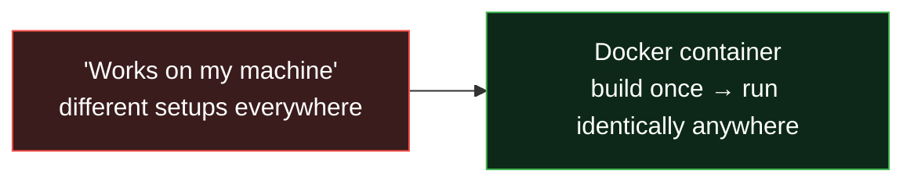
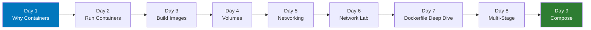

# Docker Mastery: From Containers to Production

> **Module 3 of the DevOps Masterclass.** You can version code (Git) and provision infrastructure (Terraform). Now learn to *package* your app so it runs identically everywhere - the foundation of modern deployment.

This is a hands-on, beginner-friendly Docker course. Every concept starts with a **real-world analogy** so it makes sense even if you've never touched a server. By the end you'll build, optimize, and run multi-container apps like a pro.

---

## What problem does Docker solve? (30-second version)

> *"But it works on my machine!"* - every developer, ever.

Software breaks when it moves between computers because each machine has different versions, libraries, and settings. **Docker packages your app with everything it needs into a sealed "container" that runs identically on any machine** - your laptop, a teammate's, or a giant cloud server.

---

## Interactive Animations (open in any browser - no install)

| Animation | What it teaches |
|---|---|
| [**VMs vs Containers**](animations/vms-vs-containers.html) | Why containers are so much lighter than virtual machines |
| [**Image Layers & Build Cache**](animations/image-layers.html) | How images build in layers and why instruction order makes builds fast |
| [**Docker Compose**](animations/docker-compose.html) | Watch a 3-tier app start in order with one command |

---

## Course Roadmap (9 Days)

| Day | Topic | What you'll learn |
|---|---|---|
| 1 | [Why Containers Exist](day1/notes.md) | OS, VMs vs containers, images & the "works on my machine" fix |
| 2 | [Running Containers](day2/notes.md) | IP/ports, Docker architecture, run your first container in the browser |
| 3 | [Building Your Own Image](day3/notes.md) | Dockerfile, layers & caching, `.dockerignore`, push to Docker Hub |
| 4 | [Volumes & Data Persistence](day4/volumes.md) | Why data vanishes, named volumes vs bind mounts, persist a database |
| 5 | [Docker Networking](day5/docker-networks.md) | bridge/host/none, name-based discovery, port mapping |
| 6 | [Networking Hands-On Lab](day6/demo-on-networks.md) | Prove DNS & isolation; wire frontend → backend |
| 7 | [Dockerfile Deep Dive](day7/docker-file-deep-dive.md) | Every instruction, build vs runtime, healthchecks, best practices |
| 8 | [Multi-Stage Builds](day8/multi-stage-docker-file.md) | Tiny, secure production images |
| 9 | [Docker Compose](day9/notes-docker-compose.md) | Run a full 3-tier app (UI + API + DB) with one command |

---

## Learning Outcomes
By the end you'll be able to:
- Explain containers to a non-technical person
- Build, tag, and publish your own images
- Persist data safely with volumes
- Connect containers over networks (by name)
- Write efficient, secure, small images (multi-stage)
- Orchestrate multi-container apps with Compose
- Debug containers (`logs`, `exec`, `inspect`)

---

## The Docker commands you'll use most

| Command | Meaning |
|---|---|
| `docker run -d -p 8080:80 nginx` | Create + start a container |
| `docker ps` / `docker ps -a` | List running / all containers |
| `docker build -t name .` | Build an image from a Dockerfile |
| `docker images` | List local images |
| `docker logs -f <c>` | Follow a container's logs |
| `docker exec -it <c> sh` | Open a shell inside a container |
| `docker volume create <v>` | Create persistent storage |
| `docker network create <n>` | Create a custom network |
| `docker compose up --build` | Start a whole multi-container app |
| `docker compose down` | Stop & remove the stack |

---

## Prerequisites
- Finished the [Git module](../learn-git) (helpful, not required)
- **Install [Docker Desktop](https://www.docker.com/products/docker-desktop/)** and have a terminal ready
- A code editor (VS Code recommended)

---

## Demo apps included
This module ships runnable example apps you'll containerize:
- `day3/react-frontend` - a React UI
- `day4/python-backend` - a FastAPI backend
- `day9/project` - the full 3-tier stack with a `docker-compose.yaml`

---

Ready? Start with → [**Day 1: Why Containers Exist**](day1/notes.md)
Next module → [**learn-k8s**](../learn-k8s)
