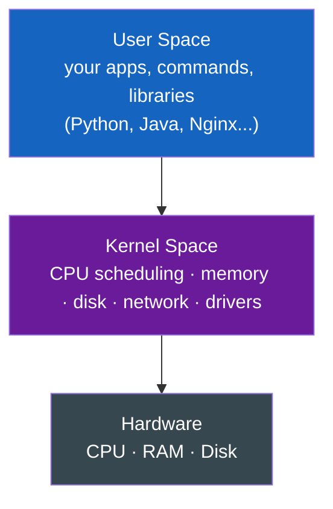
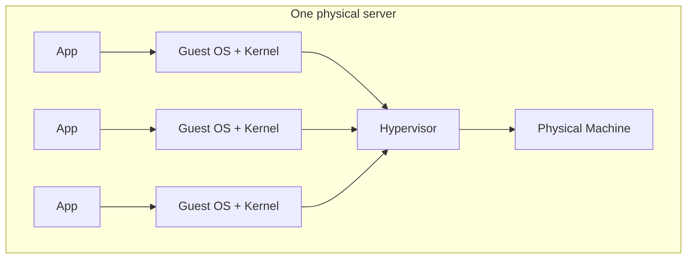
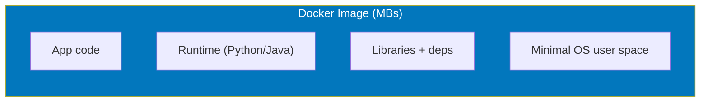
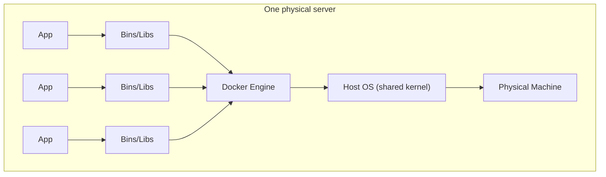
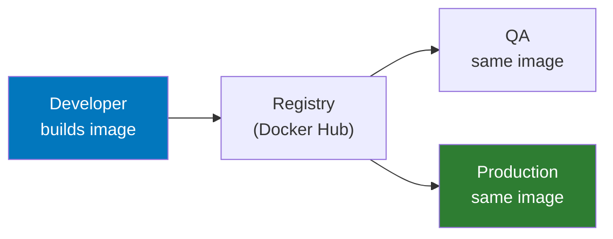
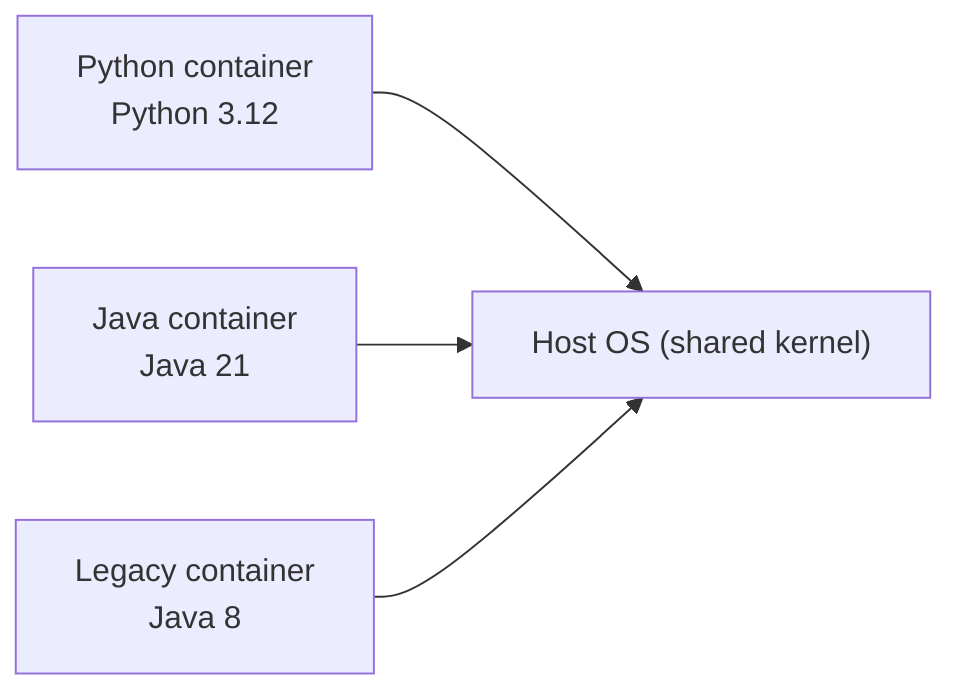

# Docker - Day 1: Why Containers Exist

> **Goal of today:** understand the *problem* Docker solves before touching a single command. We build the mental model with everyday analogies - **no prior IT knowledge needed.**

> **Open while you read:** [VMs vs Containers - interactive](../animations/vms-vs-containers.html). Click "Add 3 apps" and *watch* why containers are lighter.

---

## Objective of Day 1
By the end you'll be able to explain:
- What an Operating System actually is (kernel vs user space)
- What a Virtual Machine is, and its costs
- What a Docker image and container are
- Why "it works on my machine" happens - and how Docker kills it
- The core terms: **image, container, host, runtime**

---

## The 30-second analogy (read this first)

Before Docker, shipping software was like a **restaurant that only gives you a recipe**. You take the recipe home, but your oven is different, you're missing an ingredient, your flour is a different brand… and the dish comes out wrong. *"But it worked in the restaurant!"*

**Docker is like getting the finished dish in a sealed, microwave-ready container** - food, sauce, sides, all portioned together. Heat it anywhere - home, office, a friend's house - and it tastes *exactly* the same. That sealed container is a **Docker container**: your app plus *everything* it needs, packaged to run identically everywhere.

---

## 1 What is an Operating System (OS)?

> An **Operating System** is system software that manages hardware and gives applications a place to run.

An OS has two parts:

- **Kernel space** - the core that talks directly to hardware (the "engine room").
- **User space** - where *your* applications and commands live.

> **Remember this:** containers share the host's **kernel** but get their own **user space**. That one fact explains why they're so lightweight.

---

## 2 What is a Virtual Machine (VM)?

> A **Virtual Machine** is a software-based computer running a *complete* OS on top of physical hardware.

### Analogy
A VM is like building a **whole separate house** for every guest - each with its own foundation, plumbing, and kitchen. Total privacy, but hugely expensive and slow to build.

Each VM carries a **full OS + its own kernel**. Costs:
- Heavy images (gigabytes)
- Slow startup (minutes)
- High memory use
- Duplicated OS everywhere → more infra cost

---

## 3 VM Image vs the "works on my machine" problem

A **VM image** (e.g. an AWS AMI) is a template containing a whole OS + preinstalled software. But even with the same image, environments drift:

| Developer machine | QA machine | Production |
|---|---|---|
| Python 3.12, latest libs | different OS patch, older Python | yet more differences |

Result: **"It works on my machine!"** - environment mismatch, dependency hell, failed deploys.

---

## 4 Why Docker Was Created

Docker solves exactly these pains:
- Environment mismatch
- Dependency conflicts
- Painful deployments
- Heavy VM overhead

---

## 5 What is a Docker Image?

> A **Docker image** is a lightweight, read-only package containing your app code, runtime, libraries, and dependencies - **but not a kernel**.

| | **VM Image** | **Docker Image** |
|---|---|---|
| Contains | Full OS **+ kernel** + drivers | App + runtime + libs (no kernel) |
| Size | Gigabytes | Megabytes |
| Startup | Minutes | Seconds |

---

## 6 Containers vs VMs - the key picture

### Analogy
A container is like a **private apartment in one shared building**. You get your own locked space (isolation), but you share the building's foundation and utilities (the host **kernel**). Same privacy as a house, a fraction of the cost.

Notice: **no repeated Guest OS** per app. That's the whole win.

---

## 7 "Build once, run everywhere"

Developer → QA → Production all run the **exact same image** → identical behavior, zero "works on my machine."

---

## 8 What is a Container?

> A **container is a running instance of an image** - the image "brought to life."

### Analogy: image vs container = recipe vs cooked dish
- **Image** = the recipe/cake-mix (static template, on disk)
- **Container** = the baked cake (running, using CPU & RAM)
- One image → **many** containers (bake many cakes from one mix)

---

## 9 Real example: no more version conflicts

Without containers, one machine can't easily run Python 3.12, Java 21, *and* legacy Java 8 - they conflict.

With containers, each app gets its own sealed box:

No conflicts, clean isolation, stable deploys.

---

## Core Terminology (memorize)

| Term | Meaning | Analogy |
|---|---|---|
| **Image** | Read-only package of app + deps | Recipe / cake mix |
| **Container** | Running instance of an image | The baked cake |
| **Host** | The machine running Docker | The kitchen |
| **Runtime** | The engine that runs containers | The oven |
| **Registry** | Where images are stored/shared | The cookbook library |

---

## Quick Self-Check
1. What does a container *share* with the host that a VM does not?
2. Why is a Docker image MBs while a VM image is GBs?
3. Explain image vs container with an analogy.
4. What causes the "works on my machine" problem, and how does Docker fix it?
5. Can one image create multiple containers?

---

## End of Day 1 Summary
- OS = kernel + user space
- VM = full OS per app (heavy); container = shared kernel (light)
- Image = static package; container = running instance
- Docker = "build once, run everywhere"

Next up → [**Day 2: Running Your First Container**](../day2-running-containers/notes.md)
