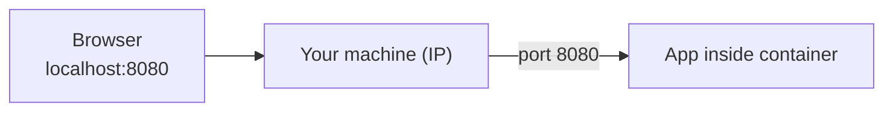
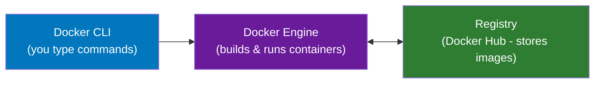
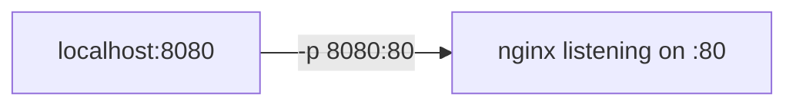
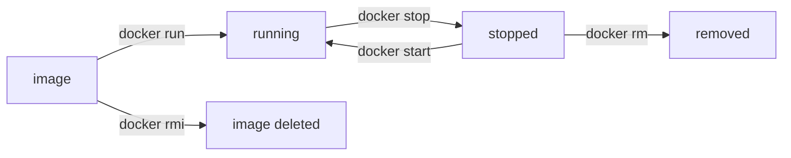

# Docker - Day 2: Running Your First Container

> **Goal of today:** install Docker, run a real app inside a container, and open it in your browser - then understand *what just happened*.

---

## Objective of Day 2
By the end you'll be able to:
- Explain IP addresses and ports (the "address system" of apps)
- Understand Docker's architecture (CLI → Engine → Registry)
- Install Docker Desktop
- Pull a public image and run a container
- Access a containerized app in your browser
- Use the essential commands: `run`, `ps`, `stop`, `start`, `rm`, `images`, `rmi`

---

## 1 Prerequisite: IP Addresses & Ports

### Analogy
- An **IP address** is the **building's street address** - it finds the *machine*.
- A **port** is the **flat/apartment number** - it finds the *specific app* inside that machine.

> *IP identifies the machine; the port identifies the application.*

### IP address
A unique address identifying a machine on a network: `192.168.1.10`, `10.0.0.5`, `127.0.0.1`.
- **Public IP** - reachable on the internet
- **Private IP** - inside a local network (`192.168.x.x`, `10.x.x.x`)
- **`localhost` (`127.0.0.1`)** - *this very machine*

### Port
A number identifying a specific app on a machine. One IP can host many apps; the port routes traffic to the right one.

| App | Port |
|---|---|
| HTTP | 80 |
| HTTPS | 443 |
| MySQL | 3306 |
| SSH | 22 |

When you visit `http://localhost:8080`:
```
localhost → your machine     8080 → the app's port
```



---

## 2 Docker Architecture

### Analogy: ordering at a restaurant
- **Docker CLI** = *you*, placing the order (`docker run...`)
- **Docker Engine** = the *kitchen* that actually cooks (builds/runs containers)
- **Registry** = the *supplier warehouse* that stocks ingredients (images)



---

## 3 Installing Docker Desktop (Windows)

> **Docker Desktop** installs the Docker Engine + CLI on Windows/Mac.

**Requirements:** Windows 10/11 64-bit • virtualization enabled in BIOS • 8 GB RAM recommended • **WSL 2** (Docker Desktop sets this up for you).

1. Download from [docker.com](https://www.docker.com/products/docker-desktop/) → **Download for Windows**.
2. Run the installer → **enable WSL 2** when prompted → keep recommended settings.
3. **Restart** your computer.
4. Launch Docker Desktop; wait for the **green "Engine running"** indicator.
5. Verify in PowerShell:
```bash
docker --version       # shows the installed version
docker info            # no error = engine is running
```

> On Windows Home, Docker uses the **WSL 2** backend (a lightweight Linux layer). That's normal and recommended.

---

## 4 Pulling a Public Image

Someone already built an Nginx web-server image and published it. Download it:
```bash
docker pull nginx
docker images          # confirm it's stored locally
```
`docker images` columns: **Repository** (name), **Tag** (version), **Image ID**, **Size**.

> An image is just a **template on disk** - pulling it does **not** run anything yet.

---

## 5 Running Your First Container

```bash
docker run -d -p 8080:80 nginx
```

| Part | Meaning |
|---|---|
| `docker run` | create **and** start a container |
| `-d` | **detached** - run in the background |
| `-p 8080:80` | **port map**: your laptop's `8080` → container's `80` |
| `nginx` | which image to use |

### Port mapping, visualized

Your laptop's port **8080** forwards into the container's port **80** where Nginx listens.

### See it work
Open `http://localhost:8080` → the **Nginx welcome page**.

> You never installed Nginx on Windows - it's running *inside the container*. That's the magic.

---

## 6 Inspecting Containers
```bash
docker ps              # running containers
docker ps -a           # ALL containers (incl. stopped)
```
Columns: Container ID • Image • Status • Ports.

---

## 7 Essential Lifecycle Commands



| Command | What it does |
|---|---|
| `docker run -d -p 8080:80 nginx` | create + start a container |
| `docker ps` / `docker ps -a` | list running / all containers |
| `docker stop <id>` | stop (but keep) a container |
| `docker start <id>` | start a stopped container |
| `docker rm <id>` | delete a container |
| `docker rmi nginx` | delete an image |
| `docker logs <id>` | view a container's output |
| `docker exec -it <id> sh` | open a shell inside a running container |

> You can use just the **first few characters** of a container ID, or give containers a name with `--name`.

---

## 8 Reinforce: Image vs Container
- **Image** = read-only template, downloaded from a registry.
- **Container** = a running instance that uses CPU & RAM.
- **One image → many containers** (run nginx 3 times → 3 containers).

```bash
docker run -d -p 8081:80 nginx
docker run -d -p 8082:80 nginx     # same image, second container
docker ps                          # two nginx containers running
```

---

## Common Beginner Mistakes
1. **Forgetting `-p`** → app runs but you can't reach it from the browser.
2. **Port already in use** (`8080`) → pick another host port (`-p 8090:80`).
3. **Confusing `stop` with `rm`** - `stop` pauses, `rm` deletes.
4. **Expecting `docker pull` to run the app** - it only downloads.

---

## Quick Self-Check
1. In `localhost:8080`, what does `8080` represent?
2. Name the three parts of Docker's architecture.
3. What does `-d` do in `docker run -d`?
4. In `-p 8080:80`, which number is the host and which is the container?
5. Difference between `docker stop` and `docker rm`?

---

## Hands-On Lab / Homework
```bash
# Task 1: run redis
docker run -d --name myredis redis
docker ps

# Task 2: run nginx on a different port
docker run -d -p 9090:80 nginx
# open http://localhost:9090

# Task 3: peek inside a container
docker exec -it myredis sh
#   (type 'exit' to leave)

# Task 4: clean up
docker ps -a
docker rm -f myredis
```

---

## End of Day 2 Summary
- IP = machine, Port = app
- Docker = CLI + Engine + Registry
- Pull an image, run a container, map ports, open in browser
- Manage the container lifecycle

Next up → [**Day 3: Building Your Own Image**](../day3-building-images/notes.md)
