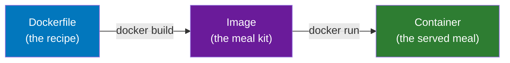
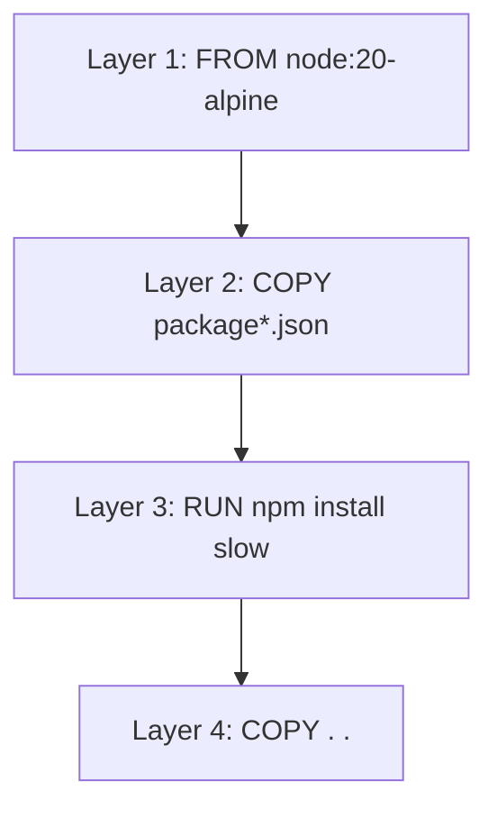
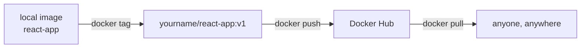

# Docker - Day 3: Building Your Own Image

> **Goal of today:** write your first **Dockerfile**, build a custom image from your own app, run it, and publish it to Docker Hub.

---

## Objective of Day 3
By the end you'll be able to:
- Explain why we build custom images instead of only using public ones
- Write a **Dockerfile**
- Build an image and run it as a container
- Understand **image layers & build caching** (why instruction order matters)
- Use a **`.dockerignore`** file
- Tag and **push** an image to Docker Hub

---

## 1 Life Without Docker (the pain)

To run a React app the traditional way, every person must:
1. Install Node.js + npm
2. Clone the code
3. `npm install` the dependencies
4. Build and start it
```bash
npm install
npm start
```
Node version mismatches, dependency conflicts, OS differences, manual setup on every machine → *"works on my laptop, breaks on QA."*

---

## 2 The Dockerized Way

### Analogy
A Dockerfile is a **recipe**. The image is the **sealed meal kit** built from that recipe. Anyone can "cook" (run) it and get the identical result - no hunting for ingredients.

> **Dockerizing** = packaging your app + runtime + dependencies into an image that runs in a container anywhere.



| | Dockerfile | Image | Container |
|---|---|---|---|
| What | Instruction text file | Static template | Running app |
| Analogy | Recipe | Cake mix | Baked cake |

---

## 3 Create a React App (if you don't have one)
```bash
npx create-react-app my-react-app
cd my-react-app
npm start          # runs at http://localhost:3000 (traditional way)
# press CTRL + C to stop
```

---

## 4 Write the Dockerfile

Create a file named exactly `Dockerfile` (no extension) in the project root:

```Dockerfile
# 1. Base image: Node.js on a tiny Alpine Linux
FROM node:20-alpine

# 2. Set the working folder inside the image
WORKDIR /app

# 3. Copy ONLY dependency files first (for better caching - see §6)
COPY package*.json ./

# 4. Install dependencies
RUN npm install

# 5. Now copy the rest of the source code
COPY . .

# 6. Document the port the app uses
EXPOSE 3000

# 7. Command to start the app when the container runs
CMD ["npm", "start"]
```

> **Use a real, current version tag** like `node:20-alpine` (LTS) or `node:22-alpine`. Avoid invented tags like `node:24-alpine` - if the tag doesn't exist, the build fails.

### What each instruction means
| Instruction | Purpose |
|---|---|
| `FROM` | The base image to start from |
| `WORKDIR` | Sets/creates the working directory inside the image |
| `COPY` | Copies files from your machine into the image |
| `RUN` | Runs a command **at build time** (e.g. install deps) |
| `EXPOSE` | Documents which port the app listens on |
| `CMD` | The command run **when the container starts** |

---

## 5 Add a `.dockerignore` (do this!)

Just like `.gitignore`, a **`.dockerignore`** keeps junk and secrets *out* of your image - making builds faster and smaller. Create `.dockerignore`:
```
node_modules
build
.git
.env
*.log
Dockerfile
```
> Never bake `node_modules` or secrets (`.env`) into an image. They bloat it and can leak credentials.

---

## 6 Image Layers & Build Caching (the pro concept)

### Analogy
An image is built in **stacked layers**, like sheets of a lasagna - **one layer per instruction**. Docker **caches** each layer. On the next build, if a layer's inputs haven't changed, Docker **reuses the cached layer instead of rebuilding it**.



**Why we `COPY package*.json` BEFORE `COPY . .`:**
- If you only change your *source code* (not dependencies), layers 1 - 3 are **reused from cache**, so `npm install` is **skipped** → builds in seconds.
- If you copied everything first, *any* code change would invalidate the cache and re-run the slow `npm install` every time.

> Inspect layers with: `docker history react-app`

---

## 7 Build the Image
```bash
docker build -t react-app .
```
- `-t react-app` → tag (name) the image
- `.` → build context (the current folder)

Docker reads the Dockerfile top-to-bottom, executing each instruction into a layer.
```bash
docker images          # see 'react-app' listed
```

---

## 8 Run Your Container
```bash
docker run -d -p 3000:3000 react-app
```
Open `http://localhost:3000` → your React app, now running inside Docker!
```bash
docker ps              # confirm it's running
```

---

## 9 Push to Docker Hub (share your image)

### Analogy
Docker Hub is like **GitHub, but for images**. You tag your image with your username, then push.

```bash
docker login                                   # enter Docker Hub username + password/token

docker tag react-app yourname/react-app:v1     # registry naming: username/image:tag

docker push yourname/react-app:v1              # upload
```
Now anyone can run it with `docker run yourname/react-app:v1`. Verify at [hub.docker.com](https://hub.docker.com).



> **Tip:** use an **access token** (Docker Hub → Account Settings → Security) instead of your password - safer, just like a GitHub PAT.

---

## Common Beginner Mistakes
1. **Invalid base image tag** (e.g. `node:24-alpine` when it doesn't exist) → build fails. Check tags on Docker Hub.
2. **No `.dockerignore`** → `node_modules` copied in, giant slow image.
3. **`COPY . .` before installing deps** → cache busted on every code change (slow builds).
4. **Forgetting to tag with your username** before push → push rejected.

---

## Quick Self-Check
1. What's the difference between a Dockerfile, an image, and a container?
2. Why copy `package*.json` *before* the rest of the source?
3. What does `.dockerignore` do, and why exclude `.env`?
4. What does `-t` do in `docker build -t react-app .`?
5. What naming format does Docker Hub require before pushing?

---

## Hands-On Lab
```bash
# from your React project folder containing the Dockerfile + .dockerignore
docker build -t react-app .
docker images
docker run -d -p 3000:3000 react-app
# open http://localhost:3000

# rebuild after a small code change - notice npm install is CACHED (fast!)
docker build -t react-app .
docker history react-app          # inspect the layers

# publish
docker login
docker tag react-app <yourname>/react-app:v1
docker push <yourname>/react-app:v1
```

---

## End of Day 3 Summary
- Wrote a Dockerfile and built a custom image
- Understood layers & caching (and why instruction order matters)
- Used `.dockerignore` to keep images clean
- Tagged and pushed an image to Docker Hub

Next up → [**Day 4: Backend Containers & Data Persistence (Volumes)**](../day4/volumes.md)
