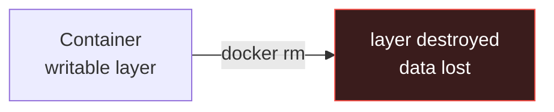
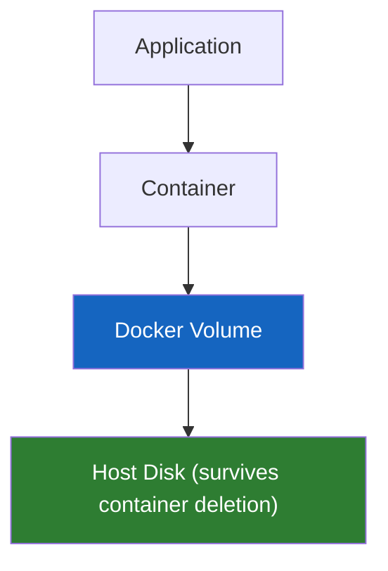
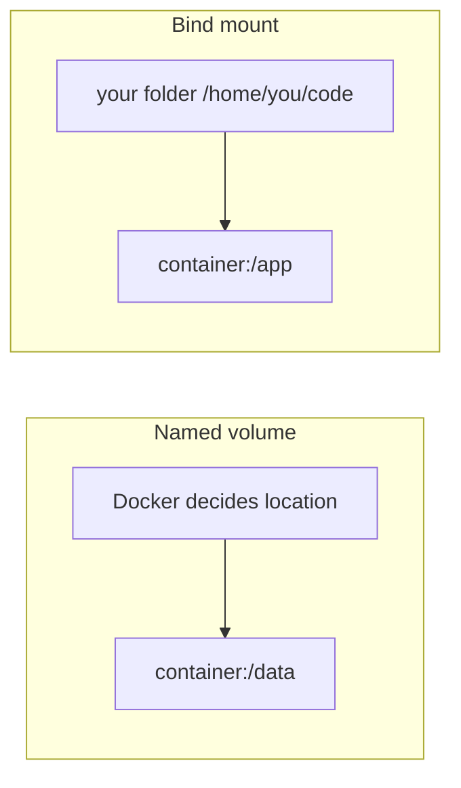

# Docker - Day 4: Backend Containers & Data Persistence (Volumes)

> **Goal of today:** containerize a backend, learn to inspect/debug containers, and solve the #1 beginner shock - **"where did my data go?!"** - with Docker volumes.

---

## Objective of Day 4
By the end you'll be able to:
- Run commands inside a container (`exec`), view logs, and inspect it
- Explain *why* container data disappears
- Use **named volumes** and **bind mounts**
- Persist a real database (MySQL) safely
- Know what to **never** store inside a container

---

## 1 Running a Backend (FastAPI) - quick recap of the traditional way
```bash
python -m venv myenv
myenv\Scripts\activate.ps1     # Windows PowerShell
# (Linux/macOS/Git Bash: source myenv/bin/activate)
pip install -r requirements.txt
uvicorn main:app --reload
```
This is the manual way (same pains as Day 1). The [day4/python-backend](python-backend/) folder has a Dockerfile so you can containerize it instead.

---

## 2 Looking Inside a Running Container

### Open a shell inside it
```bash
docker exec -it <container-name-or-id> sh      # or: bash, if available
```
### See its output / errors
```bash
docker logs <container>            # all logs
docker logs -f <container>         # follow live (like tail -f)
docker logs --tail 50 <container>  # last 50 lines
```
### Inspect its full config (IP, mounts, env)
```bash
docker inspect <container>
```
> These three - `exec`, `logs`, `inspect` - are your **debugging toolkit**. Memorize them.

---

## 3 The Shock: Container Data Disappears

### Analogy
A container's own filesystem is like **writing in the sand at the beach**. It's fine while you're there, but the next tide (removing the container) washes it all away.

Try it:
```bash
docker run -it ubuntu bash
# inside the container:
echo "Hello Docker" > test.txt
exit
docker rm <container-id>
```
`test.txt` is **gone forever**. Why?

> When a container is removed, its **writable layer is destroyed**. Containers are **ephemeral (temporary) by design.**



> **Golden rule:** never store important data inside a container's filesystem.

---

## 4 Why This Matters

Real apps store data that **must** survive restarts: database records, uploaded files, logs, reports, user content. If that vanishes when a container restarts → disaster.

---

## 5 The Solution: Docker Volumes

### Analogy
A volume is like a **bank safe-deposit box** that lives in the bank building (the **host machine**), not inside your house (the **container**). You can move house, demolish it, rebuild it - the safe-deposit box and its contents remain untouched.

> A **Docker volume** is persistent storage that lives on the **host disk**, managed by Docker, **independent of any container's lifecycle**.



| Feature | Container filesystem | Docker volume |
|---|---|---|
| Persistence | Temporary | Permanent |
| Survives `docker rm`? | No | Yes |
| Shareable between containers | No | Yes |
| Production-safe | | |

---

## 6 Two Storage Types

### Named Volume (recommended for production)
Docker manages *where* it's stored - you just give it a name.
```bash
docker volume create mydata
```
Easy, portable, safe.

### Bind Mount (great for development)
You map a *specific host folder* into the container.
```
/home/user/code → /app   (your real folder, live-synced)
```
Edit files on your machine, see changes instantly in the container.
Tied to a host path → less portable; avoid in production.



---

## 7 Hands-On: Prove Data Persists

```bash
# 1. create a named volume
docker volume create myvolume
docker volume ls

# 2. run a container WITH the volume mounted at /data
docker run -it -v myvolume:/data ubuntu bash
#    inside:
cd /data && echo "Docker Volume Test" > file.txt && ls
exit

# 3. DELETE the container
docker rm <container-id>

# 4. run a BRAND NEW container with the SAME volume
docker run -it -v myvolume:/data ubuntu bash
cd /data && ls          # file.txt is STILL HERE!
exit
```
**The container died, but the data survived.** That's the whole point.

> Syntax: `-v <volume-name>:<path-inside-container>`

---

## 8 Bind Mount Example (development)
```bash
docker run -it -v /c/users/siva/data:/app/data ubuntu bash
```
Files created in `/app/data` inside the container appear instantly in the Windows folder - perfect for live-editing code during development.

---

## 9 Real-World: a Database with a Volume (the most important use case)

### Wrong - data lost when container is removed
```bash
docker run -d -e MYSQL_ROOT_PASSWORD=root mysql
```

### Right - database files stored on a volume
```bash
docker volume create mysqldata
docker run -d \
  --name mydb \
  -v mysqldata:/var/lib/mysql \
  -e MYSQL_ROOT_PASSWORD=root \
  mysql
```
`/var/lib/mysql` is where MySQL keeps its data - mounting a volume there means you can restart, delete, or recreate the container and **your database is safe**.

---

## Production Rules

| Never store in container FS | Always use a volume for |
|---|---|
| Database files | Databases |
| Uploaded files | Persistent app state |
| Logs you need to keep | User content |
| User content | Anything that must survive |

---

## Common Beginner Mistakes
1. **Running a database without a volume** → data wiped on container removal.
2. **Confusing `-v name:/path` (named volume) with `-v /host/path:/path` (bind mount).**
3. **Using bind mounts in production** → host-path dependency, fragile.
4. **Forgetting the volume still exists** after `docker rm` - clean up with `docker volume rm` when truly done.

---

## Quick Self-Check
1. Why does data vanish when a container is removed?
2. Where does a Docker volume actually live?
3. Named volume vs bind mount - when to use each?
4. Which path do you mount a volume to for MySQL data?
5. Name three things you must never keep only in a container's filesystem.

---

## Hands-On Lab
```bash
# debugging toolkit practice
docker run -d --name web -p 8080:80 nginx
docker logs web
docker exec -it web sh         # look around, then 'exit'
docker inspect web | grep -i ipaddress

# persistence proof (see §7) then clean up
docker rm -f web
docker volume rm myvolume mysqldata 2>/dev/null
```

---

## End of Day 4 Summary
- Debug containers with `exec`, `logs`, `inspect`
- Understood why containers are ephemeral
- Used named volumes & bind mounts
- Persisted a real database safely

Next up → [**Day 5: Docker Networking**](../day5/docker-networks.md)
