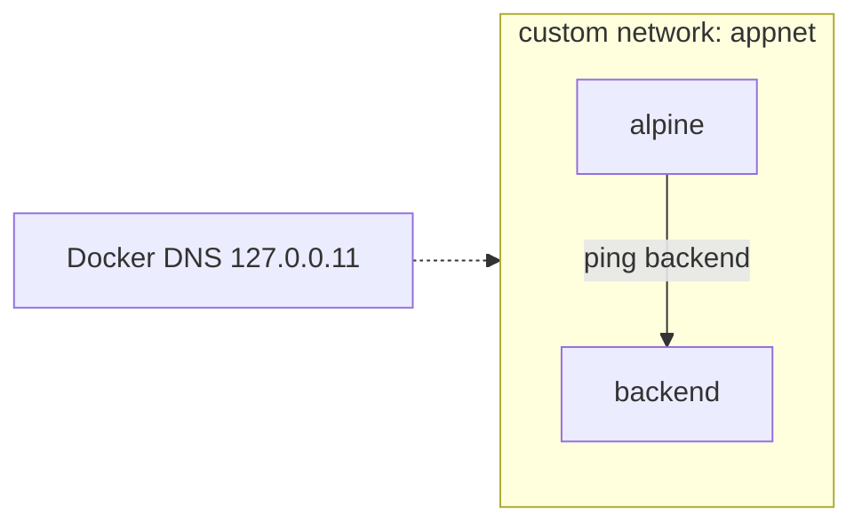
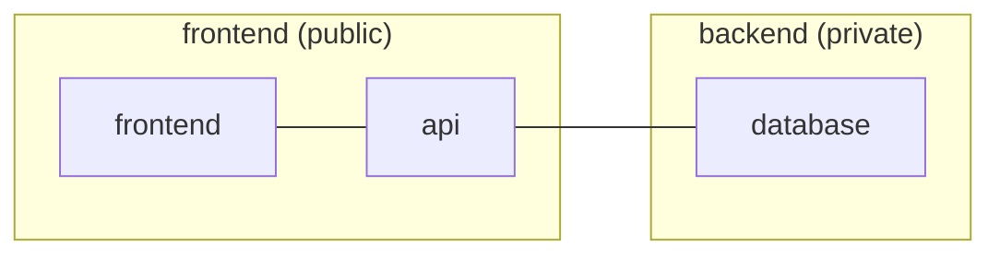

# Docker - Day 5: Docker Networking

> **Goal of today:** understand how containers talk to each other, to your browser, and to the internet - and the crucial difference between the default and custom networks.

> **Theory today, hands-on tomorrow:** [Day 6](../day6-networking-lab/notes.md) is the practical lab for everything here.

---

## Objective of Day 5
By the end you'll be able to:
- Explain the three communication directions
- Describe Docker's default networks: **bridge, host, none**
- Understand why **custom bridge networks give name-based discovery**
- Use port mapping, multi-network containers, and inspection

---

## 1 What is Docker Networking?

> Docker networking lets containers communicate with **each other**, the **host**, and the **internet**.

Each container behaves like a small computer. To talk to anything, it needs a network.


| Direction | Example |
|---|---|
| Container → Container | frontend calls backend |
| Container → Internet | download packages |
| Host → Container | your browser opens the app |

---

## 2 The Default Networks

Docker creates three automatically:
```bash
docker network ls
# bridge   host   none
```


---

## 3 Bridge Network (the default)

A private internal network. **Every container joins `bridge` automatically** unless you say otherwise.

**Behavior:**
- Each container gets a private IP
- Can reach the internet
- Needs **port mapping** (`-p`) for outside access
- **On the *default* bridge, containers can reach each other only by IP - there is NO automatic name resolution (DNS).**

```bash
docker run -d --name web -p 8080:80 nginx
docker inspect web        # find its private IP
# http://localhost:8080 works only because we used -p
```

> [!IMPORTANT]
> This "no name resolution" limit applies to the **default `bridge` only**. The moment you create your **own** (custom) bridge network, Docker gives you automatic DNS - see §4. This distinction trips up almost every beginner.

---

## 4 Custom Bridge Network (what you should actually use)

Create your own network and containers on it can find each other **by name** - Docker runs a built-in DNS server for custom networks.

```bash
docker network create appnet
docker run -d --name backend --network appnet nginx
docker run -it --network appnet alpine sh
# inside the alpine container:
ping backend        # WORKS - resolves 'backend' to its IP automatically
```

| Feature | Default `bridge` | Custom bridge |
|---|---|---|
| Name resolution (DNS) | No (IP only) | Yes |
| Service discovery | No | Yes |
| Recommended for apps | No | Yes |



> **Takeaway:** *always create a custom network for multi-container apps* so services talk by name (`mysql`, `backend`) instead of fragile IPs.

---

## 5 Port Mapping (reaching apps from your browser)

Containers are private by default. To expose one to the host:
```bash
docker run -d -p 8080:80 nginx       # host 8080 → container 80
```
Now `http://localhost:8080` reaches the container.

> Container-to-container traffic uses the **internal** port directly (no `-p` needed). `-p` is only for reaching a container **from outside Docker** (your browser).

---

## 6 Host Network
```bash
docker run --network host nginx
```
- Container **shares the host's network stack** directly
- No separate IP, no `-p` needed - access via `http://localhost`
- Highest performance, but **no network isolation**
- *Note: host networking is fully supported on Linux; on Docker Desktop (Windows/Mac) it has limitations.*

**Use case:** high-performance apps where isolation isn't needed.

---

## 7 None Network
```bash
docker run --network none alpine
```
- No internet, no inter-container comms - only loopback (itself)

**Use case:** maximum isolation, security-sensitive batch jobs.

---

## 8 Connecting a Container to Multiple Networks

A container can sit on several networks at once - the classic way to let a backend bridge a public and a private network.
```bash
docker network create frontend
docker network create backend
docker run -d --name api --network frontend nginx
docker network connect backend api      # api is now on BOTH
docker network disconnect backend api   # remove it from one
```


Here the **frontend cannot reach the database directly** - only the `api` (on both networks) can. That's a real-world security pattern.

---

## 9 Inspect & Clean Up
```bash
docker network inspect appnet     # see attached containers, IPs, subnet
docker network rm appnet          # delete (only if no container attached)
```

---

## Rules to Remember
1. Containers on the **same** network can communicate.
2. **Custom** networks give **name-based** discovery; the **default bridge does not**.
3. **Port mapping** (`-p`) is needed for browser/host access.
4. **Host** network removes isolation; **none** blocks all networking.
5. Networks provide **isolation and organization** - use them deliberately.

---

## Common Beginner Mistakes
1. **Expecting `ping backend` to work on the default bridge** - it won't; create a custom network.
2. **Forgetting `-p`** then wondering why the browser can't connect.
3. **Putting everything on one network** - separate public/private tiers for security.
4. **Hard-coding container IPs** - they change; use names on a custom network.

---

## Quick Self-Check
1. Name the three default Docker networks.
2. Why can't containers resolve each other by name on the default bridge?
3. What gives custom networks their name resolution?
4. When do you actually need `-p`?
5. How can a backend talk to both a public frontend and a private DB?

---

## End of Day 5 Summary
- Three communication directions
- bridge / host / none explained
- Custom bridge = DNS name discovery (default bridge ≠)
- Port mapping, multi-network, inspection

Next up → [**Day 6: Hands-On Networking Demo**](../day6-networking-lab/notes.md) - prove all of this yourself.
