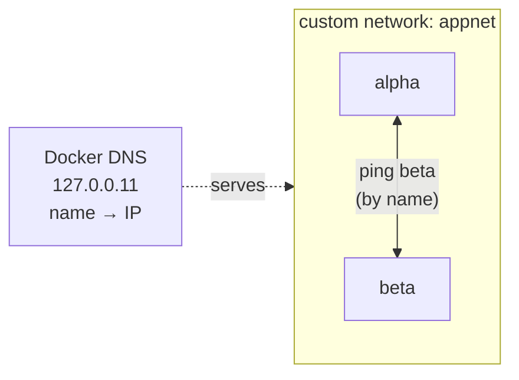
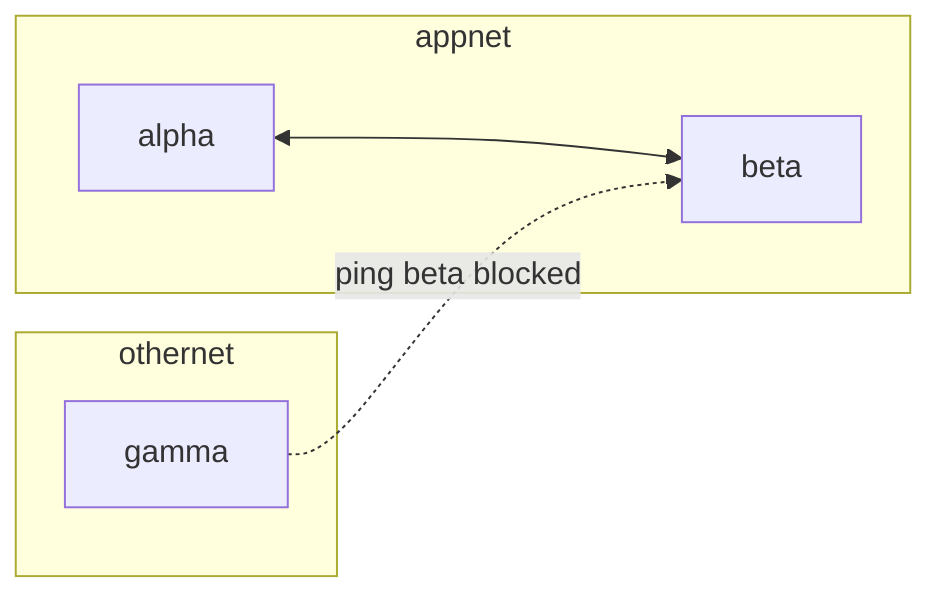
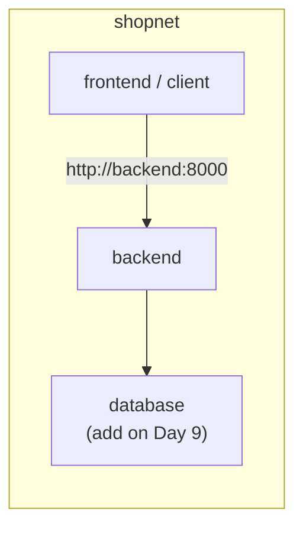

# Day 6: Hands-On Networking Demo - Containers Talking to Each Other

> **Goal of today:** prove, with your own hands, how containers find and talk to each other by **name** on a custom network - and how network **isolation** keeps them safe.

> Prerequisite: [Day 5 - Docker Networking](../day5-networking/notes.md) (the theory). Today we *do* it.
> Optional: open [vms-vs-containers.html](../animations/vms-vs-containers.html) for a refresher on why containers are so cheap to spin up.

---

## What You'll Prove Today
1. On the **default** bridge network, containers can reach each other **only by IP** (clumsy).
2. On a **custom** bridge network, containers reach each other **by name** (Docker's built-in DNS).
3. Containers **not** on the same network are **isolated** - they can't talk at all.

### Analogy
A Docker network is like a **private office floor**. People on the *same* floor can call each other by name through the internal directory (DNS). People on a *different* floor aren't in your directory at all - you can't reach them unless someone connects the floors.

---

## Demo 1 - The Default Bridge (name resolution does NOT work)

Every container joins the `bridge` network unless told otherwise. Let's see its limitation.

```bash
# start two simple containers in the background
docker run -dit --name alpha alpine sh
docker run -dit --name beta  alpine sh

# try to reach 'beta' BY NAME from 'alpha'
docker exec alpha ping -c 2 beta
```
**Result:** `ping: bad address 'beta'` - on the *default* bridge there is **no automatic DNS**, so names don't resolve.

```bash
# find beta's IP address...
docker inspect -f '{{ .NetworkSettings.IPAddress }}' beta
# ...then ping THAT ip from alpha (replace 172.17.0.x)
docker exec alpha ping -c 2 172.17.0.x
```
Pinging by **IP** works - but IPs change every restart, so this is fragile and clumsy.

```bash
# clean up
docker rm -f alpha beta
```

> [!IMPORTANT]
> This is the one nuance to remember: **automatic name resolution is a feature of *custom* networks, not the default bridge.** That's exactly why we always create our own network for real apps.

---

## Demo 2 - A Custom Bridge (name resolution WORKS )

```bash
# 1. create our own network
docker network create appnet

# 2. start two containers ON that network
docker run -dit --name alpha --network appnet alpine sh
docker run -dit --name beta  --network appnet alpine sh

# 3. now ping BY NAME - no IP needed!
docker exec alpha ping -c 2 beta
```
**Result:** it works! Docker runs an embedded DNS server (at `127.0.0.11`) on every custom network, mapping **container name → current IP** automatically.



> **Why this matters:** your web app can connect to a database using `mysql:3306` instead of a fragile IP - the name always points to the right container.

---

## Demo 3 - Network Isolation (the security win)

Put a third container on a *different* network and watch it fail to connect.

```bash
docker network create othernet
docker run -dit --name gamma --network othernet alpine sh

# gamma (othernet) tries to reach beta (appnet)
docker exec gamma ping -c 2 beta
```
**Result:** fails - `gamma` is on `othernet`, it isn't in `appnet`'s directory at all. **Isolation by default** is a security feature: only containers that *should* talk, can.



### Need them to talk? Connect the container to both networks:
```bash
docker network connect appnet gamma     # now gamma is on BOTH networks
docker exec gamma ping -c 2 beta        # works now
```

```bash
# clean up everything
docker rm -f alpha beta gamma
docker network rm appnet othernet
```

---

## Demo 4 - A Realistic 2-Tier App (frontend → backend)

Let's connect a backend API and a client on the same network, talking by name. (You can reuse the [Day 4 python-backend](../day4-volumes/python-backend/) and [Day 3 react-frontend](../day3-building-images/react-frontend/) apps.)

```bash
# 1. one network for the whole app
docker network create shopnet

# 2. run the backend (it will be reachable as 'backend')
docker run -d --name backend --network shopnet -p 8000:8000 my-python-backend

# 3. from a client container ON the same network, call it BY NAME
docker run --rm -it --network shopnet curlimages/curl curl http://backend:8000/health
```
The client reaches `http://backend:8000` using the **name** `backend` - no IPs anywhere. This is exactly how multi-container apps wire up (and it's what Docker Compose automates for you on Day 9).



---

## Handy Networking Commands

| Command | What it does |
|---|---|
| `docker network ls` | List all networks |
| `docker network create <name>` | Create a custom bridge network |
| `docker network inspect <name>` | See which containers are attached + their IPs |
| `docker network connect <net> <container>` | Attach a running container to a network |
| `docker network disconnect <net> <container>` | Detach it |
| `docker run --network <net> ...` | Start a container on a specific network |
| `docker network rm <name>` | Delete a network (must be empty) |

---

## Common Mistakes
1. **Expecting name resolution on the default `bridge`.** It only works on **custom** networks - always create your own.
2. **Forgetting `-p` (port publish)** and wondering why you can't reach the app *from your laptop*. Container-to-container uses the internal port; `-p host:container` is only needed to reach it from **outside** Docker.
3. **Putting unrelated containers on one big network** - keep apps isolated for security.
4. **Hard-coding IP addresses** - they change. Always use names.

---

## Quick Self-Check
1. Why can't two containers ping each other by name on the default bridge?
2. What provides name→IP resolution on a custom network, and at what address?
3. How do you let a container on `netA` talk to one on `netB`?
4. When do you actually need the `-p` flag?
5. Why is "isolation by default" a security benefit?

---

## End of Day 6 Summary
You proved hands-on that:
- Custom networks give **automatic name-based discovery** (DNS)
- The **default bridge** does not (IP only)
- Containers are **isolated** unless on a shared network
- Real apps wire frontend → backend → db **by name**

Next up → [**Day 7: Dockerfile Deep Dive**](../day7-dockerfile-deep-dive/notes.md) - how images are actually built.
