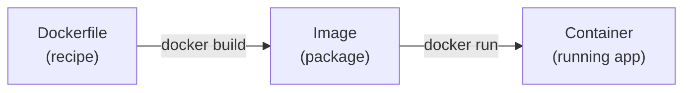
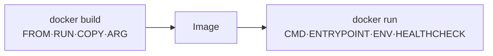

# Docker - Day 7: Dockerfile Deep Dive

> **Goal of today:** master every important Dockerfile instruction - what it does, *when* it runs (build vs runtime), and how to write efficient, secure images.

> **Open while you read:** [Image Layers & Caching - interactive](../animations/image-layers.html) to *see* how layers are built and cached.

---

## Objective of Day 7
By the end you'll be able to:
- Explain how Docker builds an image **layer by layer**
- Use all key instructions: `FROM, WORKDIR, COPY, RUN, CMD, ENTRYPOINT, EXPOSE, ENV, ARG, USER, VOLUME, LABEL, HEALTHCHECK, SHELL`
- Tell **build-time** from **runtime** instructions
- Apply best practices for size, speed, and security

---

## 1 What is a Dockerfile?

> A **Dockerfile** is a script of instructions Docker follows to build an image.



---

## 2 How Docker Builds an Image - Layers

### Analogy
Each instruction adds a **pancake to a stack**. Docker **caches** each pancake. Next build, unchanged pancakes are **reused** instead of re-cooked - that's why builds get fast.

```dockerfile
FROM python:3.11-slim     # layer 1
WORKDIR /app              # layer 2
COPY requirements.txt .   # layer 3
RUN pip install -r requirements.txt  # layer 4 (slow)
COPY . .                  # layer 5
CMD ["python","app.py"]   # metadata
```
> See the layers: `docker history <image>`

**Cache rule:** if a layer's inputs change, that layer **and every layer after it** rebuilds. So put **rarely-changing** steps (installing deps) *before* **frequently-changing** ones (copying source).

---

## 3 The Instructions

### `FROM` - base image
The starting point. Must be first (except an `ARG` before it). Multiple `FROM`s = multi-stage build (Day 8).
```dockerfile
FROM python:3.11-slim
```

### `WORKDIR` - working directory
Like `cd` inside the image; creates the dir if needed. All following commands run here.
```dockerfile
WORKDIR /app
```

### `COPY` - copy files (build time)
Copies from your machine into the image.
```dockerfile
COPY requirements.txt /app/
COPY . .
```
> Related: `ADD` can also fetch URLs and auto-extract tarballs - but **prefer `COPY`** (it's explicit and predictable).

### `RUN` - execute at build time
Used to install things; the result is baked into a layer.
```dockerfile
RUN apt-get update && apt-get install -y curl
RUN pip install -r requirements.txt
```

### `CMD` - default runtime command
Runs **when the container starts**. Can be overridden at `docker run`.
```dockerfile
CMD ["python","app.py"]
```

### `ENTRYPOINT` - fixed runtime command
Makes the container behave like an executable. `CMD` then supplies default arguments.
```dockerfile
ENTRYPOINT ["python"]
CMD ["app.py"]        # → runs: python app.py
# docker run image test.py → runs: python test.py
```

#### CMD vs ENTRYPOINT
| | CMD | ENTRYPOINT |
|---|---|---|
| Role | Default args | Main executable |
| When you pass args to `docker run` | **Replaced** | **Appended** |
> **Pattern:** `ENTRYPOINT` = the fixed program, `CMD` = its default arguments.

### `EXPOSE` - document a port
```dockerfile
EXPOSE 8000
```
> This only *documents* the port - it does **not** publish it. You still need `-p 8000:8000` at `docker run`.

### `ENV` - runtime environment variable
Available while the container runs.
```dockerfile
ENV PORT=8000
ENV DB_HOST=database
```

### `ARG` - build-time variable
Only exists during the build, **not** in the running container.
```dockerfile
ARG VERSION=3.11
FROM python:${VERSION}
```

#### ARG vs ENV
| | ARG | ENV |
|---|---|---|
| Available at build | | |
| Available in running container | | |
| Use for | version selection, build flags | app configuration |

> **Never** pass secrets via `ARG` or `ENV` - they're visible in image history. Use BuildKit secrets or runtime secret mounts.

### `USER` - drop root (security!)
```dockerfile
RUN adduser -S appuser
USER appuser
```
Running as non-root limits damage if the container is compromised.

### `VOLUME` - declare a persistent path
```dockerfile
VOLUME /data
```
Marks a directory whose data should live outside the container lifecycle (see Day 4).

### `LABEL` - metadata
```dockerfile
LABEL version="1.0" maintainer="siva"
```

### `HEALTHCHECK` - is the app actually OK?
Docker periodically runs this command and marks the container **healthy / unhealthy**.
```dockerfile
HEALTHCHECK --interval=30s --timeout=3s --retries=3 \
  CMD curl -f http://localhost:8000/health || exit 1
```
**Why it matters:** orchestrators (Compose, Kubernetes) use health status to wait for readiness, restart sick containers, and avoid routing traffic to a broken app. A container can be *running* but not *ready* - healthchecks tell the difference.

### `SHELL` - change the default shell
```dockerfile
SHELL ["/bin/bash","-c"]
```

---

## 4 Build-time vs Runtime (key table)

| Instruction | When it runs |
|---|---|
| `FROM`, `RUN`, `COPY`, `ADD`, `ARG`, `WORKDIR` | Build time |
| `CMD`, `ENTRYPOINT`, `ENV`, `EXPOSE`, `HEALTHCHECK` | Runtime (baked in, used when container runs) |



---

## 5 Best Practices

### Combine RUN steps (fewer layers)
```dockerfile
#  two layers, larger
RUN apt update
RUN apt install -y curl
#  one layer
RUN apt-get update && apt-get install -y curl && rm -rf /var/lib/apt/lists/*
```

### Order for cache wins
```dockerfile
COPY requirements.txt .
RUN pip install -r requirements.txt   # cached unless deps change
COPY . .                              # code changes don't bust the install
```

### Use minimal base images
`python:3.11-slim`, `node:20-alpine`, `nginx:alpine` → smaller, fewer vulnerabilities.

### Always add a `.dockerignore`
Keep `node_modules`, `.git`, `.env`, logs out of the build context.

### Run as non-root
Add a `USER` in the final stage.

---

## Common Mistakes
1. **`COPY . .` before installing deps** → cache busted on every code change.
2. **Expecting `EXPOSE` to publish a port** - it doesn't; use `-p`.
3. **Secrets in `ENV`/`ARG`** → leaked in image history.
4. **Running as root** in production images.
5. **One `RUN` per command** → bloated images.

---

## Quick Self-Check
1. Why does instruction order affect build speed?
2. CMD vs ENTRYPOINT - what happens to args you pass at `docker run`?
3. ARG vs ENV - which is available in the running container?
4. What does HEALTHCHECK enable that just "running" doesn't?
5. Does `EXPOSE 8000` make the app reachable from your browser?

---

## Hands-On Lab
```dockerfile
# Dockerfile - try it on a small FastAPI/Flask app
FROM python:3.11-slim
WORKDIR /app
COPY requirements.txt .
RUN pip install --no-cache-dir -r requirements.txt
COPY . .
RUN adduser -S appuser && chown -R appuser /app
USER appuser
EXPOSE 8000
HEALTHCHECK --interval=30s CMD curl -f http://localhost:8000/health || exit 1
CMD ["uvicorn","main:app","--host","0.0.0.0","--port","8000"]
```
```bash
docker build -t myapi .
docker history myapi          # inspect layers
docker run -d -p 8000:8000 myapi
docker ps                     # watch the STATUS show (healthy) after a bit
```

---

## End of Day 7 Summary
- Images build in cached layers (order matters)
- Know every key instruction + build-time vs runtime
- CMD vs ENTRYPOINT, ARG vs ENV
- Healthchecks, non-root, minimal images

Next up → [**Day 8: Multi-Stage Builds & Optimization**](../day8-multi-stage-builds/notes.md)
