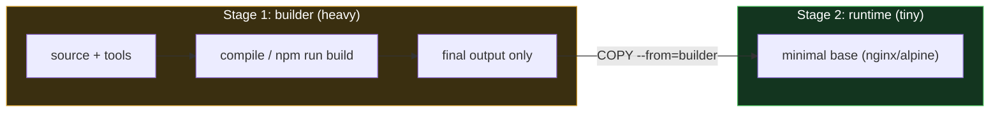
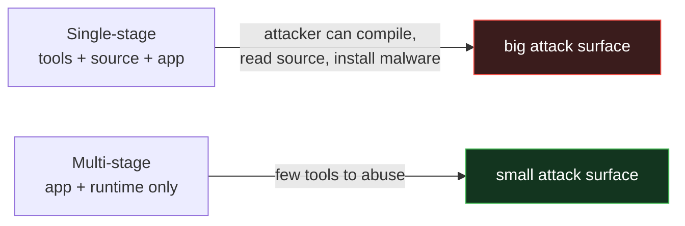

# Docker - Day 8: Multi-Stage Builds & Image Optimization

> **Goal of today:** build small, secure, production-ready images by separating the **build** environment from the **runtime** environment.

---

## Objective of Day 8
By the end you'll be able to:
- Explain why single-stage images get bloated and risky
- Write **multi-stage** Dockerfiles
- Copy only the final output into a tiny runtime image
- Understand the size **and security** benefits

---

## 1 The Problem: Bloated Single-Stage Images

### Analogy
Imagine building furniture in your living room and then **leaving all the power tools, sawdust, and packaging in the room forever**. That's a normal single-stage image - it ships your app *plus* every tool used to build it.

```dockerfile
FROM node:20
WORKDIR /app
COPY . .
RUN npm install
RUN npm run build
CMD ["npm","start"]
```
This image contains: source code, `node_modules`, build tools, package manager, caches, dev dependencies → **large, slow, and a bigger attack surface.**

But production only needs the **compiled app + a runtime**.

---

## 2 The Solution: Build in one stage, run in another

### Analogy
Build the furniture in a **workshop**, then carry *only the finished table* into the clean dining room. Leave all the tools and mess behind in the workshop.



Only files you explicitly `COPY --from` cross over. The whole builder stage is **discarded** - its tools never ship.

---

## 3 Example - React (Node build → Nginx serve)

```dockerfile
# ---- Build stage ----
FROM node:20-alpine AS build
WORKDIR /app
COPY package*.json ./
RUN npm install
COPY . .
RUN npm run build

# ---- Runtime stage ----
FROM nginx:alpine
COPY --from=build /app/build /usr/share/nginx/html
EXPOSE 80
CMD ["nginx","-g","daemon off;"]
```
Final image = **nginx + static files only**. No Node, no npm, no source.

---

## 4 Example - Python (deps build → slim runtime)

```dockerfile
FROM python:3.11 AS builder
WORKDIR /app
COPY requirements.txt .
RUN pip install --prefix=/install -r requirements.txt

FROM python:3.11-slim
COPY --from=builder /install /usr/local
COPY . .
CMD ["python","app.py"]
```

## 5 Example - Java (JDK build → JRE run)

```dockerfile
FROM maven AS build
COPY . .
RUN mvn package

FROM eclipse-temurin:17-jre
COPY --from=build target/app.jar app.jar
CMD ["java","-jar","app.jar"]
```
Build with the heavy **JDK**, run with the light **JRE**.

---

## 6 Builder vs Runtime Stage

| Builder stage | Runtime stage |
|---|---|
| Temporary (discarded) | The final shipped image |
| Heavy (compilers, tools) | Lightweight |
| Prepares the app | Runs the app |

---

## 7 Why This Matters

### Smaller images
Faster to push, pull, and start; cheaper to store; faster autoscaling.

### Better security (the big one)
A runtime image with **no compilers, shells, or package managers** gives an attacker far less to work with.



### Also: cleaner environment, immutable infra, faster CI/CD (cached layers), and your **source code isn't shipped** (only compiled output).

---

## 8 Naming & Chaining Stages
```dockerfile
FROM node AS deps
FROM node AS build
FROM nginx AS runtime
COPY --from=build /app/build /usr/share/nginx/html
```
Use **names** (`AS build`), not numbers - readable and stable.

---

## 9 Key Rules
1. Each `FROM` **resets the filesystem** - nothing carries over automatically.
2. Only `COPY --from=<stage>` transfers files between stages.
3. Only the **last stage** becomes the final image.
4. Use a **minimal** runtime base (`alpine`, `slim`, `jre`, or `scratch`).
5. Add a `USER` (non-root) in the final stage.
6. Always pair with a **`.dockerignore`**.

---

## Best Practices & When NOT to Use

**Do:** minimal runtime base, copy only needed output, named stages, non-root user.
**Avoid:** running the app in the builder stage, copying the whole project, full-OS runtime, forgetting `.dockerignore`.

**When you may not need it:** a single static file or trivial script - multi-stage shines when there's a real *build/compile* step.

---

## Common Mistakes
1. **`COPY` the entire builder** instead of just the output.
2. **Heavy runtime base** (`node:20` instead of `nginx:alpine`).
3. **Numbered stages** (`--from=0`) → fragile; name them.
4. **No `.dockerignore`** → bloated build context.

---

## Quick Self-Check
1. What does a single-stage image wastefully include?
2. What's the only way to move files from the builder to the runtime stage?
3. Which stage becomes the final image?
4. Give two security benefits of multi-stage builds.
5. When is multi-stage *not* worth it?

---

## Hands-On Lab
```bash
# build the React multi-stage example
docker build -t react-multi -f Dockerfile-mulitstage .
docker images react-multi          # compare its size to a single-stage build!
docker run -d -p 8080:80 react-multi
# open http://localhost:8080
```
Compare the size of the multi-stage image vs a single-stage one - often **10× smaller**.

---

## End of Day 8 Summary
- Single-stage = bloated + risky; multi-stage = lean + secure
- Build heavy, ship light via `COPY --from`
- Patterns for React, Python, Java
- Minimal base + non-root + `.dockerignore`

Next up → [**Day 9: Docker Compose & a Real Multi-Container App**](../day9-docker-compose/notes.md)
