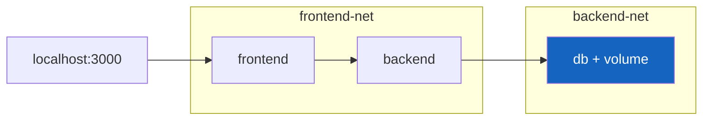

# Docker - Day 9: Docker Compose & a Real Multi-Container App

> **Goal of today:** stop typing long `docker run` commands. Define your **entire app** (frontend + backend + database) in one file and start it all with **one command**.

> **Open while you read:** [Docker Compose - interactive](../animations/docker-compose.html) to see services spin up and connect.

---

## Objective of Day 9
By the end you'll be able to:
- Explain what Docker Compose is and why it exists
- Read and write a `docker-compose.yaml`
- Run a 3-tier app (UI + API + DB) with `docker compose up`
- Use networks, volumes, env vars, `depends_on`, and healthchecks
- Add resource limits and know when you'd reach for orchestration

---

## 1 Why Docker Compose?

### Analogy
Running containers one by one with `docker run` is like making each musician play separately. **Compose is the conductor** - one wave of the baton and the whole orchestra starts together, in tune, in the right order.

### Without Compose
```bash
docker network create appnet
docker volume create dbdata
docker build -t backend ./backend
docker run -d --name db --network appnet -v dbdata:/var/lib/postgresql/data -e POSTGRES_PASSWORD=secret postgres
docker run -d --name backend --network appnet -e DATABASE_URL=... backend
docker build -t frontend ./frontend
docker run -d --name frontend --network appnet -p 3000:80 frontend
```
…every single time.

### With Compose
```bash
docker compose up --build
```
One command. Done.

---

## 2 Key Concepts

| Term | Meaning |
|---|---|
| **Service** | One part of your app (frontend, backend, db) = one container definition |
| **Image / Build** | Use a prebuilt `image:` or `build:` from a Dockerfile |
| **Volume** | Persistent storage (e.g. database data) |
| **Network** | Compose auto-creates one; services reach each other **by name** |
| **Environment** | Config passed to the container |
| **depends_on** | Startup order (optionally wait for healthy) |
| **Healthcheck** | Command that reports if a service is *ready* |

> Compose puts all services on **one custom network automatically** → they talk by service name (e.g. backend reaches the DB at `db:5432`). Remember Day 5: custom network = name-based discovery.

---

## 3 A Complete `docker-compose.yaml` (copy-paste ready)

This is a real 3-tier app: **React frontend → FastAPI backend → Postgres database.**

```yaml
services:
  # ---------- Database ----------
  db:
    image: postgres:16-alpine
    container_name: app-db
    environment:
      POSTGRES_USER: appuser
      POSTGRES_PASSWORD: secret
      POSTGRES_DB: appdb
    volumes:
      - dbdata:/var/lib/postgresql/data      #  persist data (Day 4!)
    healthcheck:                              #  is the DB ready? (Day 7!)
      test: ["CMD-SHELL", "pg_isready -U appuser -d appdb"]
      interval: 5s
      timeout: 3s
      retries: 5
    networks:
      - backend-net

  # ---------- Backend API ----------
  backend:
    build: ./backend                          # build from backend/Dockerfile
    container_name: app-backend
    environment:
      # reach the DB by its SERVICE NAME 'db' - no IP needed
      DATABASE_URL: "postgresql://appuser:secret@db:5432/appdb"
    depends_on:
      db:
        condition: service_healthy            #  wait until DB is HEALTHY
    networks:
      - backend-net
      - frontend-net

  # ---------- Frontend UI ----------
  frontend:
    build: ./frontend
    container_name: app-frontend
    ports:
      - "3000:80"                             # browser → http://localhost:3000
    depends_on:
      - backend
    networks:
      - frontend-net

# named volumes (managed by Docker)
volumes:
  dbdata:

# isolated networks: frontend can't touch the DB directly (security!)
networks:
  frontend-net:
  backend-net:
```

### What this file gives you

- The **frontend** can reach the **backend**, but **not** the database directly (separate networks = security).
- The **backend** waits for the DB to be **healthy** before starting.
- The DB's data lives on a **named volume**, surviving restarts.

---

## 4 Running It

```bash
docker compose up                 # start everything (foreground, see logs)
docker compose up -d              # detached (background)
docker compose up --build         # rebuild images first
docker compose ps                 # status of all services
docker compose logs -f            # follow logs for the whole stack
docker compose logs -f backend    # just one service
docker compose down               # stop & remove containers + network
docker compose down -v            # ALSO remove volumes (deletes DB data!)
docker compose exec backend sh    # shell into a running service
```

> `docker compose down -v` deletes your volumes too - great for a clean reset, dangerous if you wanted to keep the data.

---

## 5 Environment Variables & Secrets

- `environment:` - set values inline (as above).
- `env_file:` - load from a file:
  ```yaml
  backend:
    env_file:
      - ./backend/.env
  ```
- A `.env` file at the compose root is read by Compose itself (for variable substitution like `${TAG}`).

> **Keep secrets out of the repo.** Put them in `.env` files that are `.gitignore`d, or use Docker secrets. Never commit passwords in `docker-compose.yaml`.

---

## 6 Build vs Image
- Use **`build:`** when you have a Dockerfile + source locally.
- Use **`image:`** to pull a prebuilt image from a registry.
- You can combine them to build *and* tag:
  ```yaml
  backend:
    build: ./backend
    image: yourname/backend:v1
  ```

---

## 7 Resource Limits (production hygiene)

Stop one container from hogging the whole host:
```yaml
  backend:
    build: ./backend
    deploy:
      resources:
        limits:
          cpus: "0.50"      # max half a CPU
          memory: 512M      # max 512 MB RAM
```
> Limits prevent a memory leak in one service from taking down the entire machine (and trigger predictable OOM behavior instead).

---

## 8 Why Healthchecks + `depends_on` Together?

`depends_on` alone only waits for a container to **start**, not to be **ready**. A database process can be "up" but not yet accepting connections. Pairing it with `condition: service_healthy` makes the backend wait until the DB **actually answers** - preventing the classic "connection refused on startup" crash.

---

## 9 Beyond Compose: Orchestration (a peek)

Compose is perfect for **one machine** (dev, small deployments). When you need many machines, auto-scaling, self-healing, and rolling updates across a cluster, you graduate to an **orchestrator**:
- **Docker Swarm** - Docker's built-in clustering (Compose-like syntax).
- **Kubernetes** - the industry standard (the entire next module! → [`learn-k8s`](../../learn-k8s)).


---

## Common Mistakes
1. **Using `depends_on` without a healthcheck** → backend starts before DB is ready, crashes.
2. **Committing secrets** in the compose file → use `.env` (gitignored).
3. **`docker compose down -v` by accident** → wipes your database volume.
4. **Putting everything on one network** → no isolation between tiers.
5. **No volume on the DB** → data lost on `down`.

---

## Quick Self-Check
1. What single command starts your whole multi-container app?
2. How does the backend reach the database - by IP or by name?
3. Why pair `depends_on` with `condition: service_healthy`?
4. What does `docker compose down -v` remove that `down` doesn't?
5. When would you move from Compose to Kubernetes?

---

## Hands-On Lab
The [day9/project](project/) folder contains a full working stack. Try:
```bash
cd day9/project
docker compose up --build         # watch all three services start in order
docker compose ps                 # see them running + (healthy)
# open http://localhost:3000
docker compose logs -f backend    # watch the API logs
docker compose down               # stop (keep data)
docker compose up -d              # data still there thanks to the volume
docker compose down -v            # full clean-up
```

---

## End of Day 9 Summary - Docker course complete!
- Compose defines a whole app in one file
- Services talk by name on auto-created networks
- Volumes persist data; healthchecks + depends_on order startup
- Resource limits + secrets hygiene for production
- Next stop: orchestration with Kubernetes

Next module → [**learn-k8s**](../../learn-k8s) - run containers at scale.
